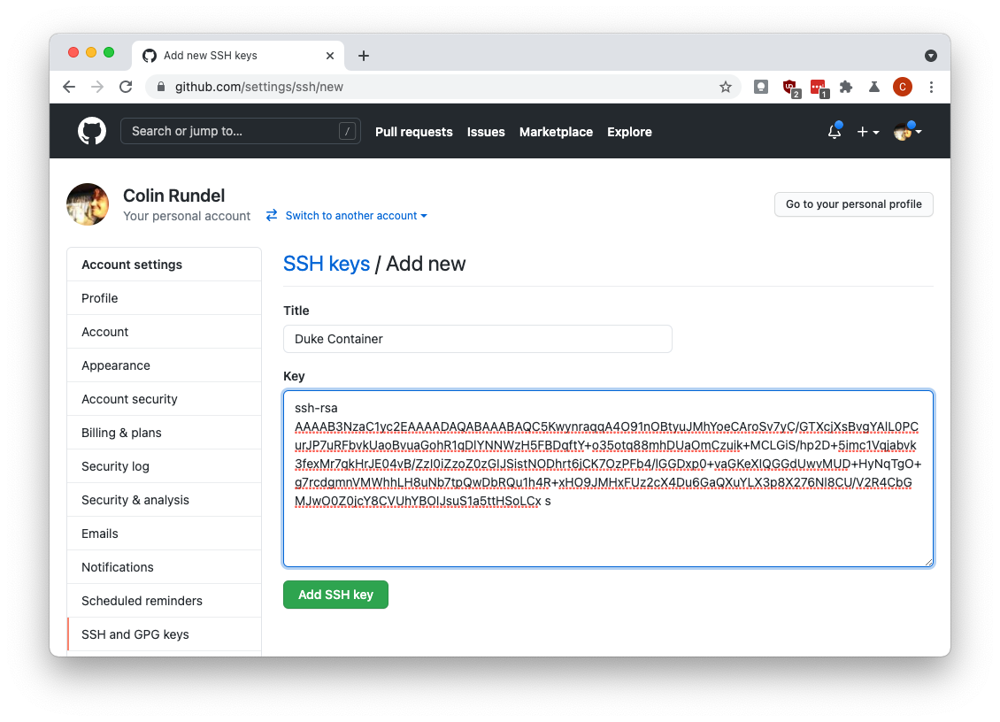
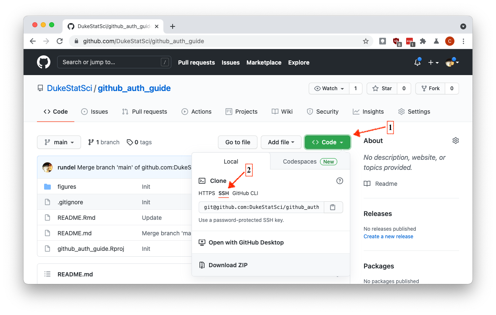
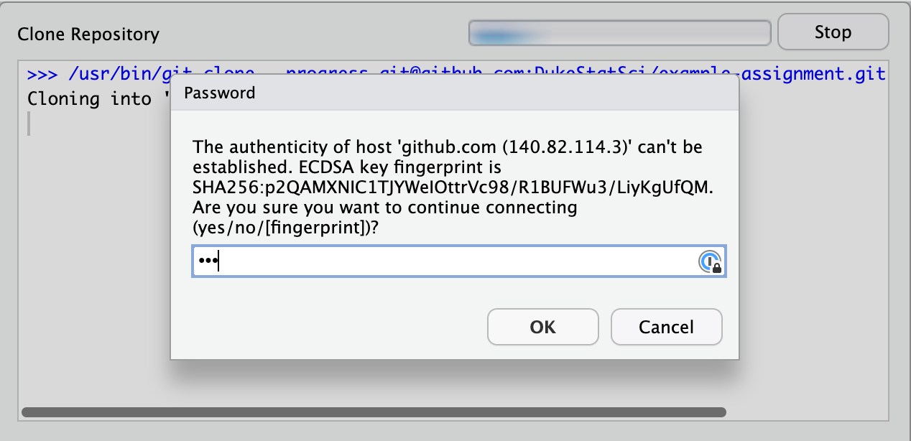
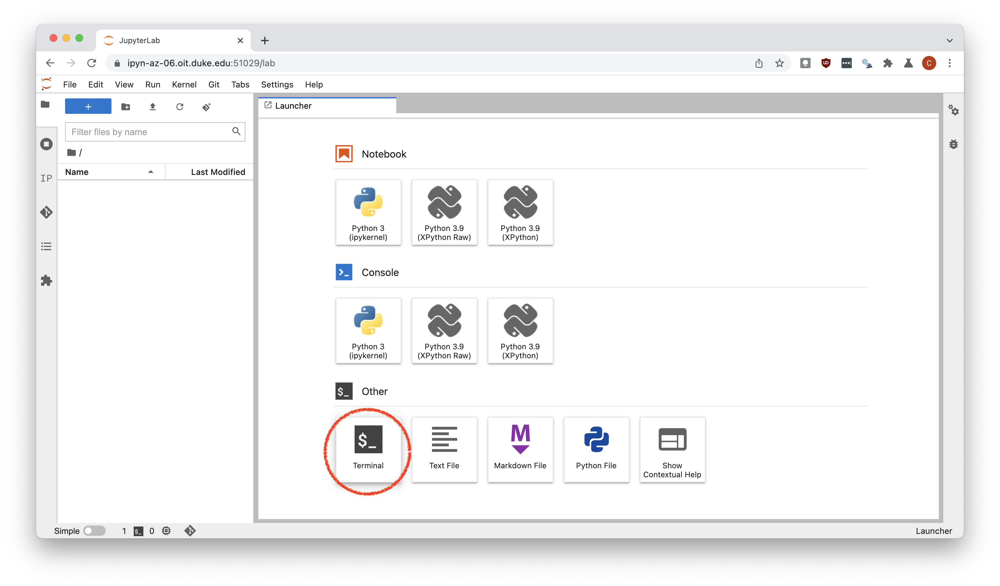

# Guide for configuring GitHub authentication

This is meant to be a brief guide for setting up GitHub authentication
via `ssh` - this is now the easiest approach to authentication as GitHub
no longer supports the use of [account
passwords](https://github.blog/2020-12-15-token-authentication-requirements-for-git-operations/).

## Configuration using R / RStudio

If R and or RStudio is available on the environment you are using then
the following is the recommended configuration using R. Note that while
this is done in R, the SSH key configuration will be available for any
other tools using git (e.g. Jupyter) on the same system.

We will begin by creating a public private key pair using the
`credentials` package, run the following line in the RStudio Console:

``` r
credentials::ssh_setup_github()
```

The function will first prompt you to create an SSH key pair if one does
not already exist

``` r
## No SSH key found. Generate one now? 
## 
## 1: Yes
## 2: No
## 
## Selection: 
```

Select Yes by entering `1` and hitting enter. The key pair will be
generated and the resulting public key will be printed,

``` r
## Generating new RSA keyspair at: /home/guest/.ssh/id_rsa
## Your public key:
## 
##  ssh-rsa AAAAB3NzaC1yc2EAAAADAQABAAABAQC5KwynraqqA4O91nOBtyuJMhYoeCAroSv7yC/GTXcjXsBvgYAlL0PCurJP7uRFbvkUaoBvuaGohR1qDlYNNWzH5FBDqftY+o35otq88mhDUaOmCzuik+MCLGiS/hp2D+5imc1Vqjabvk3fexMr7qkHrJE04vB/ZzI0iZzoZ0zGIJSistNODhrt6jCK7OzPFb4/lGGDxp0+vaGKeXIQGGdUwvMUD+HyNqTgO+g7rcdgmnVMWhhLH8uNb7tpQwDbRQu1h4R+xHO9JMHxFUz2cX4Du6GaQXuYLX3p8X276Nl8CU/V2R4CbGMJwO0Z0jcY8CVUhYBOIJsuS1a5ttHSoLCx 
```

You will then be prompted to enter this public key to GitHub, via the
provided link, you can also select Yes here to have the function open a
browser window directly to this page.

``` r
## Please copy the line above to GitHub: https://github.com/settings/ssh/new
## Would you like to open a browser now? 
## 
## 1: Yes
## 2: No
## 
## Selection:
```

If you are not logged into GitHub the website will ask you to do so,
once logged in you should see the following form:


You should enter a meaningful name for the key and then copy and paste
the entire public key



Once finished, you can click the green Add SSH key button. This key
should now show in the list of GitHub SSH keys on
<https://github.com/settings/keys>.

You can now test that the SSH authentication is working by attempting to
clone a private repository (make sure to select the SSH url and not
HTTPS).



When cloning a project for the first time, you might see a prompt that 
says the authenticity of host can't be established and asks whether you 
want to continue connecting. Type yes in the box and hit OK.



## Configuration using Jupyter Lab (or Shell)

If the machine you are using does not have R or RStudio installed you
can instead use the following steps. Once the Jupyter Lab session is
started select the `Terminal` option from the `Other` row.



This will launch a shell on the remote machine which will let you run
the necessary commands to create your SSH keys. In this prompt run the
following command:

``` shell
ssh-keygen
```

When prompted to “Enter file in which to save the key” you should just
hit enter / return to use the provided default. You will also be asked
to select a passphrase (a password for your private key), you are
welcome to set this or not (just hit enter / return again). If a
passphrase is set, you will be prompted to enter it every time git /
Jupyter Lab / RStudio needs access to the SSH key. Overall your session
should resemble somethiing like the following:

``` shell
$ ssh-keygen
Generating public/private rsa key pair.
Enter file in which to save the key (/home/jovyan/.ssh/id_rsa): 
Created directory '/home/jovyan/.ssh'.
Enter passphrase (empty for no passphrase): 
Enter same passphrase again: 
Your identification has been saved in /home/jovyan/.ssh/id_rsa
Your public key has been saved in /home/jovyan/.ssh/id_rsa.pub
The key fingerprint is:
SHA256:knCAvwhJkb+cx8W8lAunbjgzKuQJCsVuNQPCXqZywb8 jovyan@fa45fed244b1
The key's randomart image is:
+---[RSA 3072]----+
|.oo..            |
|.+=o .           |
|o+==. + .        |
|+o+.*+ O         |
|.=.o+=O S        |
|o.++E+ +         |
|*.. +            |
|oo = o           |
|... =            |
+----[SHA256]-----+
```

In order to obtain your actual public SSH key you should enter the
command:

``` shell
cat ~/.ssh/id_rsa.pub
```

which should look something like the following when run in Jupyter Lab:

``` shell
$ cat ~/.ssh/id_rsa.pub
ssh-rsa AAAAB3NzaC1yc2EAAAADAQABAAABgQC/pZ2lAOvg67JQ4/LVot1Eg9YVyw6+hrAUVFuymVLqBrNI3NLipKxOM3kjzgupHG/TQGiwZ6FGifNWTH5/IoK85rFE9DU5AK8PhL3vJzagRStqf/T/724GtzrdVHtwQnW/8SIlpn//XGAGFzXRCDVFJppsL+5Pm1CUO/BHdDmeTQzqqx5DHsSXmDGdWgpdyWvlxwU/yOgbU4P513svWUgwQzRs4gZTLeLbc9+XqrXxpOF6XMg18k0j54xQ2qJ4aHU/Ar9vivGlqsMQ1nXbjo0CYua0GvBOtsaVSTVf5KCh0osZx5LqXXXS9fblxpLnhnYS5BTJPYoHrDDsEfYpf+f92N3EsQnKgudVGUQCIO+AgCX8YG2YR451KiV7UUJ2gW/zY+yGmc/tkhoU6OV1mIbGTSb14tTR907LNtIImkgdTcE8CxKVUx2ZCtwRgmptJ96Fi7VqoUoLRg/Sch3Z7Qls61Z14MziSzxgezfgwQVyRl4jXa+g/5QkqoTC0Adb4Ss= jovyan@fa45fed244b1
```

You should now copy to your clipboard the entire contents of this
output, from `ssh-rsa` through `= jovyan@fa45fed244b1` however this last
bit will likely differ slightly depend on the server being used.

Once the SSH key has been copied to your clipboard you should now go to
the GitHub SSH keys settings page (<https://github.com/settings/keys>),
click the `New SSH Key` button and paste the key into the form.
Providing a title to help you identify which machine this SSH key is
associated with will be useful.

In order to test that the SSH key based authentication is working you
should run the following command:

``` shell
ssh -T git@github.com
```

Which should prompt you to add GitHub permanently to the list of known
hosts. Type `yes` and enter to this prompt and you should see the
following:

``` shell
$ ssh -T git@github.com
The authenticity of host 'github.com (140.82.113.4)' can't be established.
ED25519 key fingerprint is SHA256:+DiY3wvvV6TuJJhbpZisF/zLDA0zPMSvHdkr4UvCOqU.
This key is not known by any other names
Are you sure you want to continue connecting (yes/no/[fingerprint])? yes
Warning: Permanently added 'github.com' (ED25519) to the list of known hosts.
Hi rundel! You've successfully authenticated, but GitHub does not provide shell access.
```

If you get an error around a failure to authenticate then you should go
back and check that you copied and pasted the SSH key correctly.

## Frequently Asked Questions

1.  **What happens if I already have an SSH key?**

    Nothing bad, the `creditials` package will recognize this and just
    print the existing public SSH key. If you want to get rid of the
    existing key you will need to delete the `id_rsa` and `id_rsa.pub`
    files from the `.ssh` directory in your home directory. If using
    Jupyter Lab / the terminal the `ssh-keygen` command will prompt you
    before overwriting any existing SSH keys.

2.  **How do I protect my private key?**

    The private key of your key pair is saved as a file in a folder
    called `.ssh` in your home directory, having access to the file is
    equivalent to having your password (at least as far as git
    interactions are concerned). By default, permissions should be set
    such that only your user account should be able to access that file.
    If you would like additional security you can encrypt this key using
    a passphrase (i.e. password) via
    `credentials::ssh_update_passphrase()` which will then be required
    each time the key pair is used (e.g. pushing, pulling, etc.).

3.  **I get an error about an unprotected private key file when trying
    to use git**

    If you are seeing an error message that looks like the following:

        @@@@@@@@@@@@@@@@@@@@@@@@@@@@@@@@@@@@@@@@@@@@@@@@@@@@@@@@@@@
        @         WARNING: UNPROTECTED PRIVATE KEY FILE!          @
        @@@@@@@@@@@@@@@@@@@@@@@@@@@@@@@@@@@@@@@@@@@@@@@@@@@@@@@@@@@
        Permissions 0644 for '/home/guest/.ssh/id_rsa' are too open.
        It is required that your private key files are NOT accessible by others.
        This private key will be ignored.
        Load key "/home/guest/.ssh/id_rsa": bad permissions
        git@github.com: Permission denied (publickey).
        fatal: Could not read from remote repository.

        Please make sure you have the correct access rights
        and the repository exists.

    this is likely due to your system having a slightly outdated version
    of the `credentials` package which had a bug where the wrong
    permissions were applied to the key pair files. You can either fix
    the permissions to remove read access to anyone but yourself or
    update `credentials`, delete the existing keys, and start the
    process over. See Google for documentation on how to change
    permissions on your specific OS.

4.  **I set this up for my container and now it won’t work on the stat
    server (or some other computer)**

    This process, much like git configuration, must be done on each
    machine you intend to use, or at least each file system. Generally
    the recommendation is to create a new key pair for each machine you
    will be using, e.g. OIT container, stat server, your laptop, etc.
    The process is quick and GitHub supports the addition of multiple
    public SSH keys.
