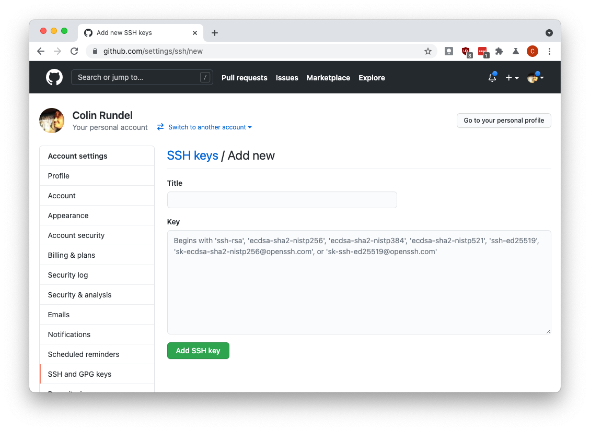

# Guide for configuring GitHub authentication

This is meant to be a brief guide for setting up GitHub authentication
via ssh - this configuration will be done in R but once setup the ssh
keys will be available for any other tools using git (e.g. Jupyter) on
the same system.

We will begin by creating a public private key pair using the
`credentials` package, run the following line in the RStudio Console:

``` r
credentials::ssh_setup_github()
```

The function will first prompt you to create an SSH key pair if one does
not already exist

``` r
## No SSH key found. Generate one now? 
## 
## 1: Yes
## 2: No
## 
## Selection: 
```

Select Yes by entering `1` and hitting enter. The key pair will be
generated and the resulting public key will be printed,

``` r
## Generating new RSA keyspair at: /home/guest/.ssh/id_rsa
## Your public key:
## 
##  ssh-rsa AAAAB3NzaC1yc2EAAAADAQABAAABAQC5KwynraqqA4O91nOBtyuJMhYoeCAroSv7yC/GTXcjXsBvgYAlL0PCurJP7uRFbvkUaoBvuaGohR1qDlYNNWzH5FBDqftY+o35otq88mhDUaOmCzuik+MCLGiS/hp2D+5imc1Vqjabvk3fexMr7qkHrJE04vB/ZzI0iZzoZ0zGIJSistNODhrt6jCK7OzPFb4/lGGDxp0+vaGKeXIQGGdUwvMUD+HyNqTgO+g7rcdgmnVMWhhLH8uNb7tpQwDbRQu1h4R+xHO9JMHxFUz2cX4Du6GaQXuYLX3p8X276Nl8CU/V2R4CbGMJwO0Z0jcY8CVUhYBOIJsuS1a5ttHSoLCx 
```

You will then be prompted to enter this public key to GitHub, via the
provided link, you can also select Yes here to have the function open a
browser window directly to this page.

``` r
## Please copy the line above to GitHub: https://github.com/settings/ssh/new
## Would you like to open a browser now? 
## 
## 1: Yes
## 2: No
## 
## Selection:
```

If you are not logged into GitHub the website will ask you to do so,
once logged in you should see the following form:


